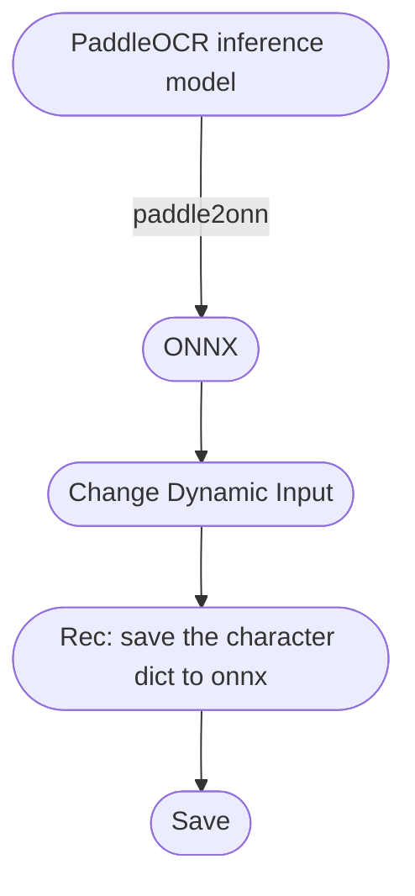

English | [简体中文](https://github.com/RapidAI/PaddleOCRModelConverter/blob/main/docs/README_zh.md)

## PaddleOCR Model Convert
<p>
     <a href="https://huggingface.co/spaces/SWHL/PaddleOCRModelConverter" target="_blank"></a>
     <a href="https://www.modelscope.cn/studios/liekkas/PaddleOCRModelConverter/summary" target="_blank"></a>
     <a href="">=3.6,<3.12-aff.svg"></a>
     <a href=""></a>
     <a href="https://pypi.org/project/paddleocr_convert/"></a>
     <a href="https://pepy.tech/project/paddleocr_convert"></a>
     <a href='https://paddleocrmodelconverter.readthedocs.io/en/latest/?badge=latest'>
         
     </a>
</p>

- This repository is mainly to convert [Inference Model in PaddleOCR](https://github.com/PaddlePaddle/PaddleOCR/blob/release/2.6/doc/doc_ch/models_list.md) into ONNX format.
- **⚠️Note**:
   - Only support the **reasoning model** in the download address in [link](https://github.com/PaddlePaddle/PaddleOCR/blob/release/2.6/doc/doc_ch/models_list.md), if it is a training model, Manual conversion to inference format is required.
   - **Input**: **url** or local **tar** path of inference model
   - **Output**: converted **ONNX** model
   - If it is a recognition model, you need to provide the original txt path of the corresponding dictionary (**Open the txt file in github, click the path after raw in the upper right corner, similar to [this](https://raw.githubusercontent.com/PaddlePaddle/PaddleOCR/release/2.6/ppocr/utils/ppocr_keys_v1.txt)**), used to write the dictionary into the ONNX model
   - ☆ It needs to be used with the relevant reasoning code in [RapidOCR](https://github.com/RapidAI/RapidOCR)
   - If you encounter a model that cannot be successfully converted, you can check which steps are wrong one by one according to the ideas in the figure below.


### Overall framework


### Steps for usage
1. Install `paddleocr_convert`
    ```bash
    pip install paddle ocr_convert
    ```
2. Using the command line
    - Usage:
         ```bash
         $ paddleocr_convert -h
         usage: paddleocr_convert [-h] [-p MODEL_PATH] [-o SAVE_DIR]
                                 [-txt_path TXT_PATH]

         optional arguments:
         -h, --help show this help message and exit
         -p MODEL_PATH, --model_path MODEL_PATH
                                 The inference model url or local path of paddleocr.
                                 e.g. https://paddleocr.bj.bcebos.com/PP-
                                 OCRv3/chinese/ch_PP-OCRv3_det_infer.tar or
                                 models/ch_PP-OCRv3_det_infer.tar
         -o SAVE_DIR, --save_dir SAVE_DIR
                                 The directory of saving the model.
         -txt_path TXT_PATH, --txt_path TXT_PATH
                                 The raw txt url or local txt path, if the model is
                                 recognition model.
         ```
    - Example:
         ```bash
         #online
         $ paddleocr_convert -p https://paddleocr.bj.bcebos.com/PP-OCRv3/chinese/ch_PP-OCRv3_det_infer.tar \
                             -o models

         $ paddleocr_convert -p https://paddleocr.bj.bcebos.com/PP-OCRv3/chinese/ch_PP-OCRv3_rec_infer.tar\
                             -o models\
                             -txt_path https://raw.githubusercontent.com/PaddlePaddle/PaddleOCR/release/2.6/ppocr/utils/ppocr_keys_v1.txt

         # offline
         $ paddleocr_convert -p models/ch_PP-OCRv3_det_infer.tar\
                             -o models

         $ paddleocr_convert -p models/ch_PP-OCRv3_rec_infer.tar\
                             -o models\
                             -txt_path models/ppocr_keys_v1.txt
         ```
3. Script use
     - online mode
         ```python
         from paddleocr_convert import PaddleOCRModelConvert

         converter = PaddleOCRModelConvert()
         save_dir = 'models'
         #online
         url = 'https://paddleocr.bj.bcebos.com/PP-OCRv3/chinese/ch_PP-OCRv3_rec_infer.tar'
         txt_url = 'https://raw.githubusercontent.com/PaddlePaddle/PaddleOCR/release/2.6/ppocr/utils/ppocr_keys_v1.txt'

         converter(url, save_dir, txt_path=txt_url)
         ```
     - offline mode
         ```python
         from paddleocr_convert import PaddleOCRModelConvert

         converter = PaddleOCRModelConvert()
         save_dir = 'models'
         model_path = 'models/ch_PP-OCRv3_rec_infer.tar'
         txt_path = 'models/ppocr_keys_v1.txt'
         converter(model_path, save_dir, txt_path=txt_path)
         ```

4. Use the model method:
      - Assuming that the model needs to be recognized in Japanese, and it has been converted, the path is `local/models/japan.onnx`
     1. Install `rapidocr_onnxruntime` library
         ```bash
         pip install rapidocr_onnxruntime
         ```
     2. Script use
         ```python
         from rapidocr_onnxruntime import RapidOCR

         model_path = 'local/models/japan.onnx'
         engine = RapidOCR(rec_model_pat

### Changelog

<details>
    <summary>Click to expand</summary>

- 2023-07-27 v0.0.16 update:
   - Added the online conversion version of ModelScope.
   - Change python version from python 3.6 ~ 3.11.
- 2023-04-13 update:
   - Add online conversion program [link](https://huggingface.co/spaces/SWHL/PaddleOCRModelConverter)
- 2023-03-05 v0.0.4~7 update:
   - Support transliteration of local models and dictionaries
   - Optimize internal logic and error feedback
- 2023-02-28 v0.0.3 update:
   - Added setting to automatically change to dynamic input for models that are not dynamic input
- 2023-02-27 v0.0.2 update:
   - Encapsulate the conversion model code into a package, which is convenient for self-help model conversion
- 2022-08-15 v0.0.1 update:
   - Write the dictionary of the recognition model into the meta in the onnx model for subsequent distribution.

</details>