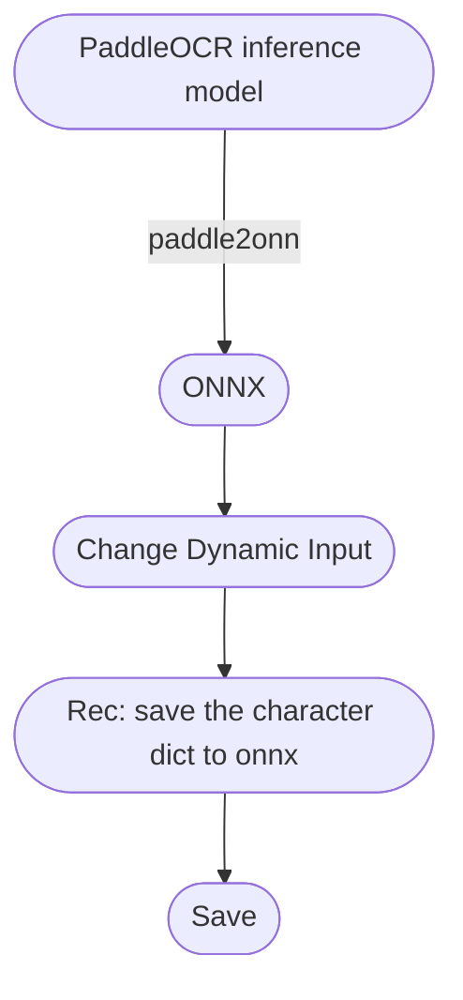

[English](https://github.com/RapidAI/PaddleOCRModelConverter) | 简体中文

## PaddleOCR Model Convert
<p>
    <a href="https://huggingface.co/spaces/SWHL/PaddleOCRModelConverter" target="_blank"></a>
    <a href="https://www.modelscope.cn/studios/liekkas/PaddleOCRModelConverter/summary" target="_blank"></a>
    <a href="">=3.6,<3.12-aff.svg"></a>
    <a href=""></a>
    <a href="https://pypi.org/project/paddleocr_convert/"></a>
    <a href="https://pepy.tech/project/paddleocr_convert"></a>
    <a href='https://paddleocrmodelconverter.readthedocs.io/en/latest/?badge=latest'>
        
    </a>
    <a href="https://github.com/psf/black"></a>
</p>

- 🎉 推出知识星球[RapidAI私享群](https://t.zsxq.com/0duLBZczw)，这里的提问会优先得到回答和支持，也会享受到RapidAI组织后续持续优质的服务。欢迎大家的加入。
- 本仓库主要是针对性地将[PaddleOCR中推理模型](https://github.com/PaddlePaddle/PaddleOCR/blob/release/2.6/doc/doc_ch/models_list.md)转换为ONNX格式。
- **⚠️注意**：
  - 仅支持[link](https://github.com/PaddlePaddle/PaddleOCR/blob/release/2.6/doc/doc_ch/models_list.md)中下载地址中的**推理模型**，如果是训练模型，需要手动转换为推理格式。
  - **输入**：推理模型的**url**或者本地**tar**路径
  - **输出**：转换后的**ONNX**模型
  - 如果是识别模型，需要提供对应字典的原始txt路径（**打开github中txt文件，点击右上角raw之后的路径，类似[这个](https://raw.githubusercontent.com/PaddlePaddle/PaddleOCR/release/2.6/ppocr/utils/ppocr_keys_v1.txt)**），用来将字典写入到ONNX模型中
  - ☆ 需要搭配[RapidOCR](https://github.com/RapidAI/RapidOCR)中相关推理代码使用
  - 如果遇到不能成功转换的模型，可根据下图思路，逐一排查哪一步出错了。


### 整体思路


### 使用步骤
1. 安装`paddleocr_convert`
   ```bash
   pip install paddleocr_convert
   ```
2. 命令行使用
   - 用法:
        ```bash
        $ paddleocr_convert -h
        usage: paddleocr_convert [-h] [-p MODEL_PATH] [-o SAVE_DIR]
                                [-txt_path TXT_PATH]

        optional arguments:
        -h, --help            show this help message and exit
        -p MODEL_PATH, --model_path MODEL_PATH
                                The inference model url or local path of paddleocr.
                                e.g. https://paddleocr.bj.bcebos.com/PP-
                                OCRv3/chinese/ch_PP-OCRv3_det_infer.tar or
                                models/ch_PP-OCRv3_det_infer.tar
        -o SAVE_DIR, --save_dir SAVE_DIR
                                The directory of saving the model.
        -txt_path TXT_PATH, --txt_path TXT_PATH
                                The raw txt url or local txt path, if the model is
                                recognition model.
        ```
   - 示例:
        ```bash
        # online
        $ paddleocr_convert -p https://paddleocr.bj.bcebos.com/PP-OCRv3/chinese/ch_PP-OCRv3_det_infer.tar \
                            -o models

        $ paddleocr_convert -p https://paddleocr.bj.bcebos.com/PP-OCRv3/chinese/ch_PP-OCRv3_rec_infer.tar \
                            -o models \
                            -txt_path https://raw.githubusercontent.com/PaddlePaddle/PaddleOCR/release/2.6/ppocr/utils/ppocr_keys_v1.txt

        # offline
        $ paddleocr_convert -p models/ch_PP-OCRv3_det_infer.tar \
                            -o models

        $ paddleocr_convert -p models/ch_PP-OCRv3_rec_infer.tar \
                            -o models \
                            -txt_path models/ppocr_keys_v1.txt
        ```
3. 脚本使用
    - online mode
        ```python
        from paddleocr_convert import PaddleOCRModelConvert

        converter = PaddleOCRModelConvert()
        save_dir = 'models'
        # online
        url = 'https://paddleocr.bj.bcebos.com/PP-OCRv3/chinese/ch_PP-OCRv3_rec_infer.tar'
        txt_url = 'https://raw.githubusercontent.com/PaddlePaddle/PaddleOCR/release/2.6/ppocr/utils/ppocr_keys_v1.txt'

        converter(url, save_dir, txt_path=txt_url)
        ```
    - offline mode
        ```python
        from paddleocr_convert import PaddleOCRModelConvert

        converter = PaddleOCRModelConvert()
        save_dir = 'models'
        model_path = 'models/ch_PP-OCRv3_rec_infer.tar'
        txt_path = 'models/ppocr_keys_v1.txt'
        converter(model_path, save_dir, txt_path=txt_path)
        ```

4. 使用模型方法：
     - 假设要用日文识别模型，且已经转好，路径为`local/models/japan.onnx`
    1. 安装`rapidocr_onnxruntime`库
        ```bash
        pip install rapidocr_onnxruntime
        ```
    2. 脚本使用
        ```python
        from rapidocr_onnxruntime import RapidOCR

        model_path = 'local/models/japan.onnx'
        engine = RapidOCR(rec_model_path=model_path)

        img = '1.jpg'
        result, elapse = engine(img)
        ```
    3. 命令行使用
        ```bash
        $ rapidocr_onnxruntime -img 1.jpg --rec_model_path local/models/japan.onnx
        ```


### 更新日志

<details>

- 2023-07-27 v0.0.16 update:
  - 增加魔搭在线转换版本
  - 更改python版本从python 3.6 ~ 3.11
- 2023-04-13 update:
  - 添加在线转换程序[link](https://huggingface.co/spaces/SWHL/PaddleOCRModelConverter)
- 2023-03-05 v0.0.4~7 update:
  - 支持对本地的模型和字典转写
  - 优化内部逻辑和错误反馈
- 2023-02-28 v0.0.3 update:
  - 添加对不是动态输入的模型自动更改为动态输入的设置
- 2023-02-27 v0.0.2 update:
  - 将转换模型代码封装成包，便于自助转模型
- 2022-08-15 v0.0.1 update:
  - 将识别模型的字典写入到onnx模型中的meta中，便于后续分发。

</details>
